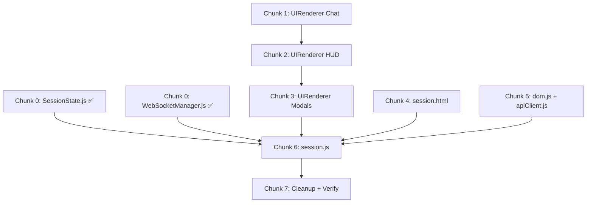

# 09 — Chunked Execution Schedule (Phase 3 Frontend)

> Breaks the [Execution Blueprint](08_session_execution_blueprint.md) into safe,
> token-friendly chunks. Each chunk produces one complete, runnable module.

---

## Progress Key

| Symbol | Meaning |
|--------|---------|
| ✅ | Completed in prior session |
| 🔲 | Pending |

---

## Pre-Flight (Already Complete)

| # | Action | Status |
|---|--------|--------|
| 0a | DELETE `frontend/script2.js` | ✅ Done |
| 0b | CREATE `frontend/js/core/SessionState.js` | ✅ Done (5.2 KB) |
| 0c | CREATE `frontend/js/core/WebSocketManager.js` | ✅ Done (6.8 KB) |

---

## Chunk 1 — `UIRenderer.js` Part 1: Chat & Lockout

**File:** `frontend/js/core/UIRenderer.js`

**Scope (functions to implement):**
- `constructor(domRefs)` — stores dom reference object
- `appendUserMessage(text)` — creates user message bubble in chat
- `appendKidoMessage(text)` — creates AI message with typing dots, returns `{ element, bubble }` for typewriter
- `typeMessage(bubbleElement, text)` — word-by-word typewriter animation (from script.js L861-885)
- `appendHintMessage(text)` — hint note with bulb icon (from script.js L888-925 hint path)
- `setChatLockout(locked)` — disable/enable input+send+spark (from script.js L837-858)
- `clearChat()` — remove all messages, show welcome (from script.js L826-832)

**Dependencies:** `dom.js` (existing)
**Estimated size:** ~180 lines

**⏸ STOP after this chunk. Wait for "proceed".**

---

## Chunk 2 — `UIRenderer.js` Part 2: HUD, Progress & Concept Card

**File:** `frontend/js/core/UIRenderer.js` (append to existing)

**Scope (functions to add):**
- `updateHud(evaluatorLabel)` — maps backend labels to HUD states, triggers AudioManager (from script.js L431-493)
- `updateBktProgress(pct)` — fills progress bar, ring stub, peek card (from script.js L386-423)
- `updateConceptCard(entry)` — delta ghost visuals, fade transitions (from script.js L499-601)

**Includes:** All SVG icon constants (HUD_ICON_*, BADGE_CONFIG), HUD_STATES map, evaluator label → HUD key mapping table.

**Dependencies:** `window.AudioManager` (existing global)
**Estimated size:** ~200 lines

**⏸ STOP after this chunk. Wait for "proceed".**

---

## Chunk 3 — `UIRenderer.js` Part 3: Roadmap, KWL, Modals & Connection State

**File:** `frontend/js/core/UIRenderer.js` (append to existing)

**Scope (functions to add):**
- `updateSessionTitle(title)` — sets nav bar session title
- `renderTopicList(topics, currentIdx, skippedIndices)` — icon-led topic cards (from script.js L166-236)
- `renderKwlList(knowledge)` — thought stream cards (from script.js L669-689)
- `addKnowledge(text, type, delta, knowledge)` — pushes to knowledge array + renders
- `setCubeState(widgetType)` — disabled for TEXT, glowing for PROCESS/COMPARISON
- `showMindMapModal(mindMapData)` / `hideMindMapModal()` / `getMindMapCorrections()` — C3 stub
- `showWidgetModal(widgetType, widgetData)` / `hideWidgetModal()` / `getWidgetSubmission()` — C3 stub
- `showSessionCompleteOverlay(sessionId)` — end session CTA
- `showLoading()` / `hideLoading()` — loading overlay toggle
- `showConnectionState(state)` — connecting/connected/error indicator

**Dependencies:** None new
**Estimated size:** ~250 lines

**⏸ STOP after this chunk. Wait for "proceed".**

---

## Chunk 4 — `session.html` Modifications

**File:** `frontend/session.html`

**Scope (all HTML changes):**
1. Remove `<script src="https://cdn.tailwindcss.com">` (line 11)
2. Clear hardcoded session title `Machine Learning` → empty (line 140)
3. Remove `<script src="script2.js">` (line 822 — already deleted, remove the tag)
4. Add **Loading Overlay** (`#session-loading`) after modals section
5. Add **Mind Map Checkpoint stub modal** (`#mindmap-checkpoint-modal`) — C3
6. Add **Widget stub modal** (`#widget-modal`) — C3
7. Add **Session Complete overlay** (`#session-complete-overlay`) with "View Feedback" button
8. Replace bottom script block with new module loading order (session.js + Lottie preservation)

**Dependencies:** All JS modules from Chunks 0-3 must exist
**Estimated size:** ~60 lines of HTML additions + deletions

**⏸ STOP after this chunk. Wait for "proceed".**

---

## Chunk 5 — `dom.js` Update + `apiClient.js` Strip

**File 1:** `frontend/js/core/dom.js` — Add new element refs for stub modals, loading overlay, session complete overlay, widget modal.

**File 2:** `frontend/apiClient.js` — Remove:
- `sendChatMessage()` + its `normalizeChatResponse()` helper
- `finalizeSession()`
- `skipToTopic()`

Keep: `fetchSession()`, `fetchSessionFeedback()`, `fetchDashboardState()`, all auth functions.

**Estimated size:** ~30 lines changed across 2 files

**⏸ STOP after this chunk. Wait for "proceed".**

---

## Chunk 6 — `session.js` Entry Point Orchestrator

**File:** `frontend/session.js`

**Scope (the main orchestrator):**
1. **C2 Boot Failsafe:** Parse `?sessionId=`, redirect if missing
2. REST bootstrap via `LearnBackAPI.fetchSession(sessionId)`
3. Redirect to `dashboard.html` on fetch failure (C2)
4. Instantiate `SessionState`, `UIRenderer`, `WebSocketManager`
5. Populate UI from REST data (title, topics, BKT)
6. Wire WS callbacks: `onKidoResponse`, `onMindMap`, `onSessionComplete`, `onConnectionChange`, `onError`
7. Wire DOM events: Send button, Enter key, Cube button, Mind Map submit/skip, Widget submit, Start Session gate, View Feedback, panel collapse/expand, header dropdown
8. Theme toggle initialization (from script.js L12-46)

**Dependencies:** All Chunks 0-5 must be complete
**Estimated size:** ~250 lines

**⏸ STOP after this chunk. Wait for "proceed".**

---

## Chunk 7 — `sessionStore.js` Cleanup + Final Verification

**File:** `frontend/sessionStore.js`

**Scope:**
- Remove `syncLegacySession()` and related legacy key syncing
- Remove `buildFallbackFeedback()` (fake feedback generator)
- Keep core `getSession()` / `updateSession()` as write-behind cache

**Then: Verification Checklist**
1. Load `session.html?sessionId=1` in browser
2. Check console for import errors
3. Verify REST bootstrap → UI populated
4. Verify WS connects
5. Send test chat message
6. Check HUD updates

**After passing:** Mark `script.js` for deletion (Step 12 from blueprint).

**⏸ STOP after this chunk. Final review before script.js deletion.**

---

## Dependency Graph

## Estimated Total

| Chunk | Lines | Cumulative |
|-------|-------|------------|
| 0 (done) | ~280 | 280 |
| 1 | ~180 | 460 |
| 2 | ~200 | 660 |
| 3 | ~250 | 910 |
| 4 | ~60 | 970 |
| 5 | ~30 | 1000 |
| 6 | ~250 | 1250 |
| 7 | ~30 | 1280 |
| **Total** | **~1280 lines** | of clean modular code |
